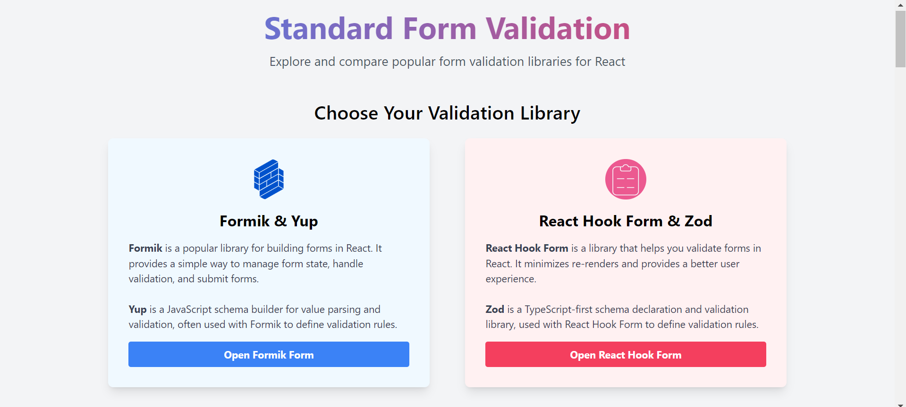

<figure> </figure> 


# Form Validation with Formik/Yup and React Hook Form/Zod

## Overview

This project demonstrates how to manage forms using two popular form management libraries in React: Formik with Yup for validation, and React Hook Form with Zod for validation. It provides examples and comparisons between the two approaches, showcasing their usage for handling complex forms with validation.

## Technologies Used

- **React**: A JavaScript library for building user interfaces.
- **Formik**: A popular form management library for React applications.
- **Yup**: A JavaScript schema builder for value parsing and validation.
- **React Hook Form**: A lightweight and flexible form validation library for React.
- **Zod**: A TypeScript-first schema declaration and validation library.

## Features

- **Formik & Yup Example**:
  - Implements a registration form with various fields like username, email, password, age, website, phone, address, etc.
  - Provides validation using Yup schema validation.
  - Handles form submission and displays validation errors.

- **React Hook Form & Zod Example**:
  - Implements a similar registration form using React Hook Form and Zod.
  - Uses a different approach to validation with Zod schema.
  - Manages form state and validation dynamically.

- **Modal for Form Submission Confirmation**:
  - Upon successful form submission, displays a pop-up modal showing the submitted data.
  - Styled to enhance user experience and readability.

## Project Installation

To run this project locally:

1. Clone the repository:
   ```bash
   git clone https://github.com/mayankyadav1711/form-validation.git
   cd form-validation
   ```
2. Install dependencies:
   ```bash
   npm install
   ```
3. Start the development server::
   ```bash
   npm start
   ```

